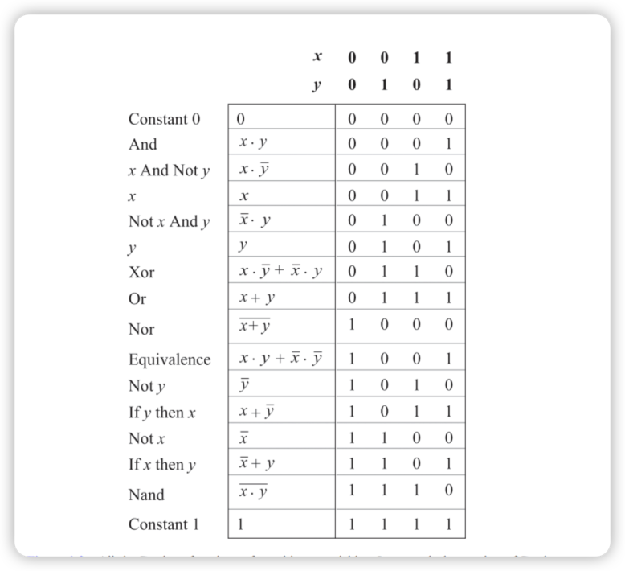
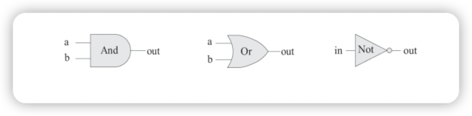
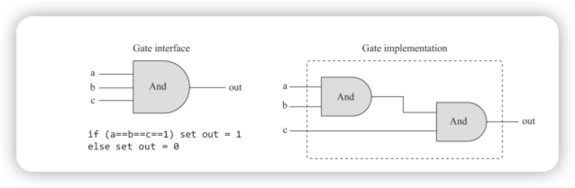
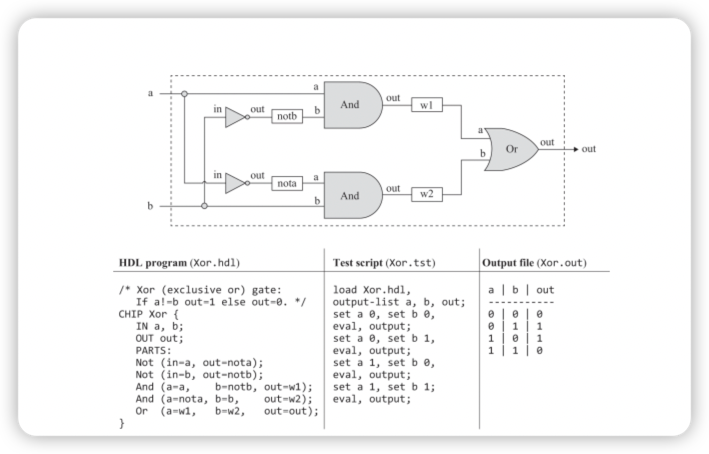

# The element of computer 

This content is written when I was reading "The element of computer".

abstraction and implementation 

modular design

software stack 

assembler: it's a program that translates low level programs in symbolic machine language into executable binary code.

virtual machine:

compiler:

operating system:

## Boolean Logic 

multiplexer and demultiplexer: 

### Boolean Algebra 

* And  
* Or 
* Not
* Nand: Nand(x,y) -> Not(And(x,y))
* Xor: exclusive or -> evaluates to 1 when exactly one of its two variables is 1.
* Nor: Not-Or

### Truth Table and Boolean Operation 

A truth table is often a convenient means for describing some states of nature, whereas a Boolean expression is a convenient formalism for realizing this description in silicon. 

### Logic Gates 

A gate is a physical device that implements a simple Boolean function. 

Figure img_2: Standard gate diagrams of three elementary logic gates

Figure img_3: Composite implementation of a three-way And gate. The rectangular dashed outline defines the boundary of the gate interface.

We can see the logic gate above in two different perspectives: internal and external. The right side is the gate's internal architecture, or implementation, whereas, the left side is describing the gate's interface, namely, it's input and output. The internal view is only relevant to the gate builder, whereas the external view is the right level of details for designers who wish to use the gate as an abstract, off-the-shelf component, without paying attention to its implementation.

To sum up, the art of logic design can be described as follows: Given a gate abstraction (also referred to as specification, or interface), find an efficient way to implement it using other gates that were already implemented.

### Hardware Construction

An HDL definition of a chip consists of a header section and a parts section. 

The header section specifies the chip interface, listing the chip name and the names of its input and output pins. 

The parts section describes the chip-parts from which the chip architecture is made. Each chip-parts is represented by a single statement that specifies the part name, followed by a parenthetical expression that specifies how it is connected to other parts in the design. 

