# Build a Modern Computer 

* How computer systems work
* How to break complex problems into mamageable modules
* How to build large-scale hardware and software systems

[Home Page](https://www.nand2tetris.org/)

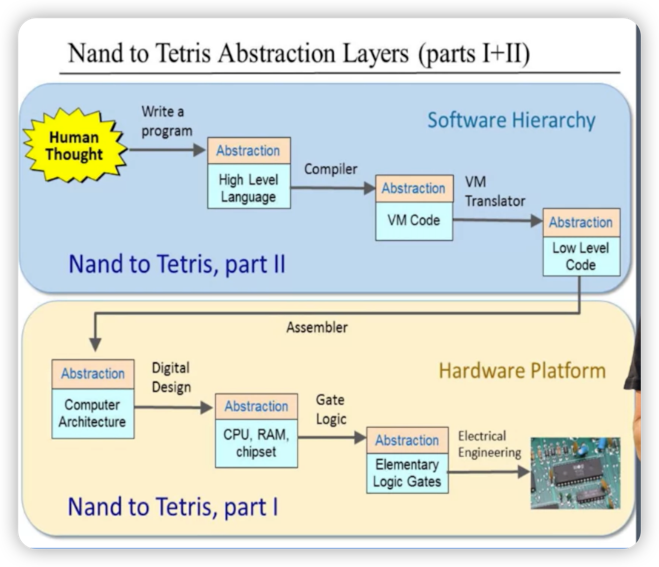

## Key Concept 
Boolean algebra, Boolean functions, gate logic, elementary logic gates, Hardware Description Language (HDL), hardware simulation.

## Introduction 
* Every Week:
    * Worry about a single level 
    * Take the lower level as given 
    * Implement the Higher level 
    * Test that it works
    
* Outcome: You have built a computer functioning computer
    *   That can run anything including games like Tetris
    *   Using only modest Nand gates
    *   You have experienced implementing abstractions
    *   You have learned what was needed for every step
    

### Boolean Operations

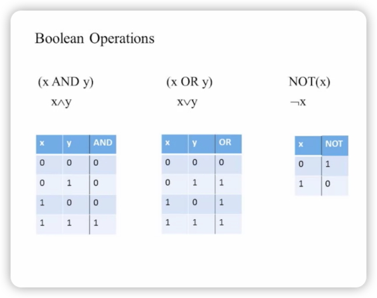
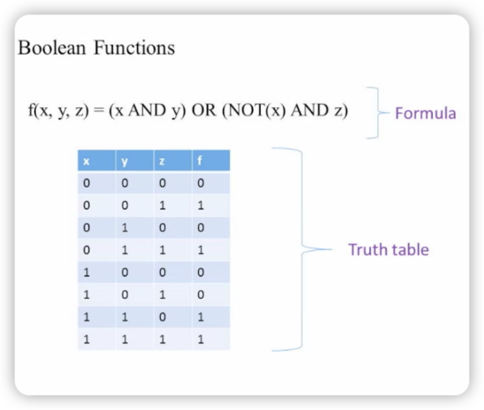
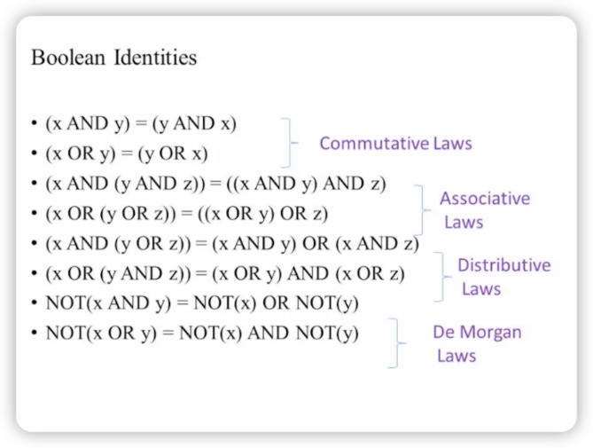
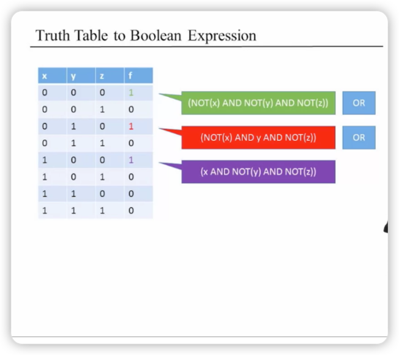
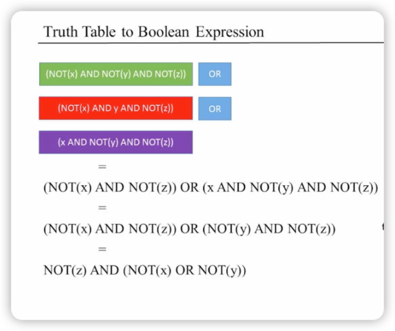
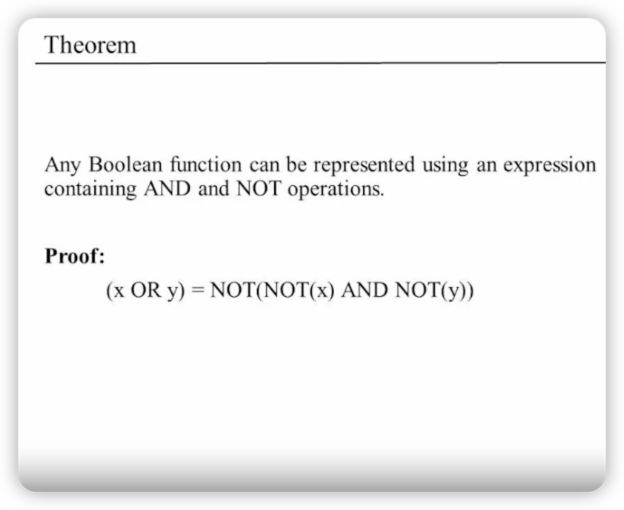
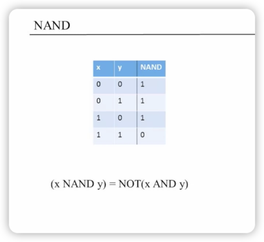
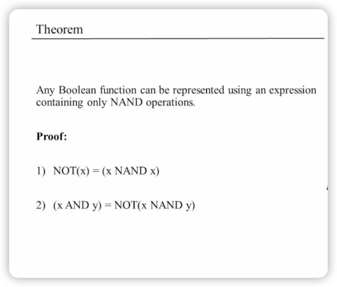 

### Logic Gates
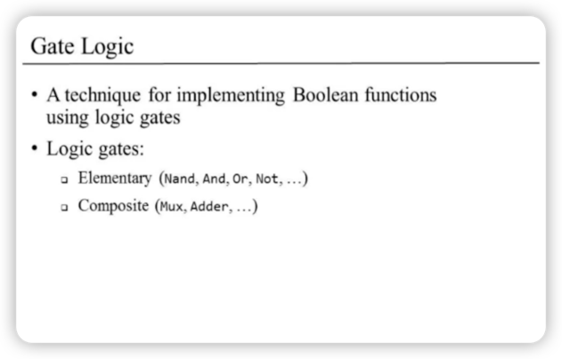
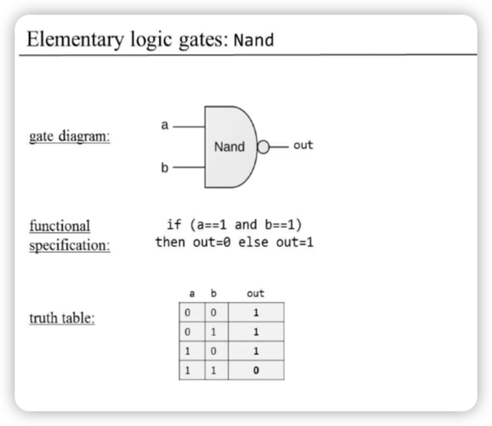
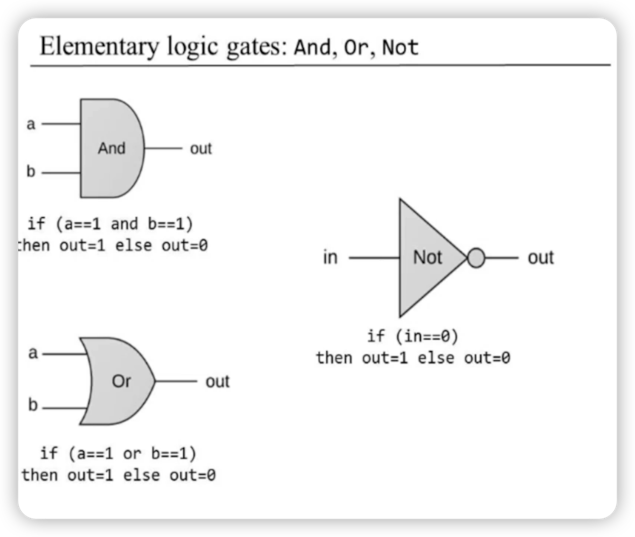
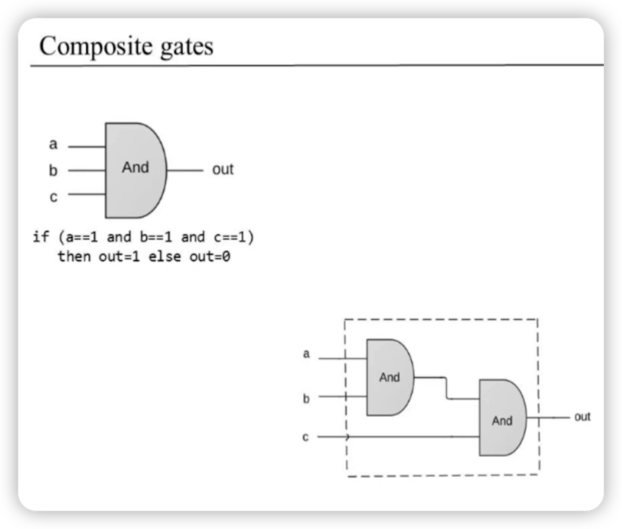
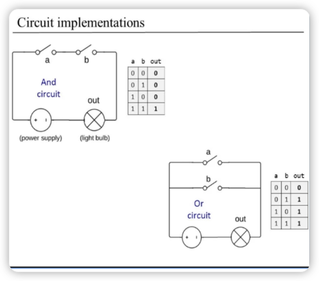
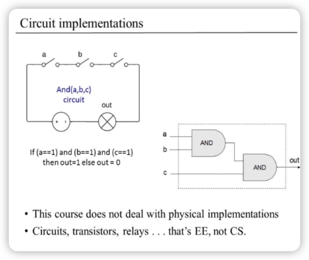

### HDL(Hardware Description Language)
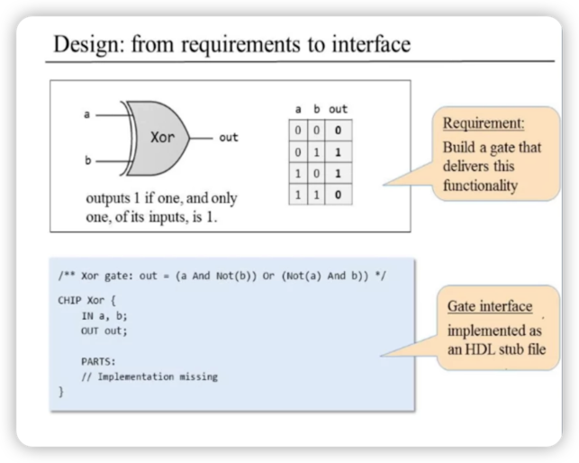
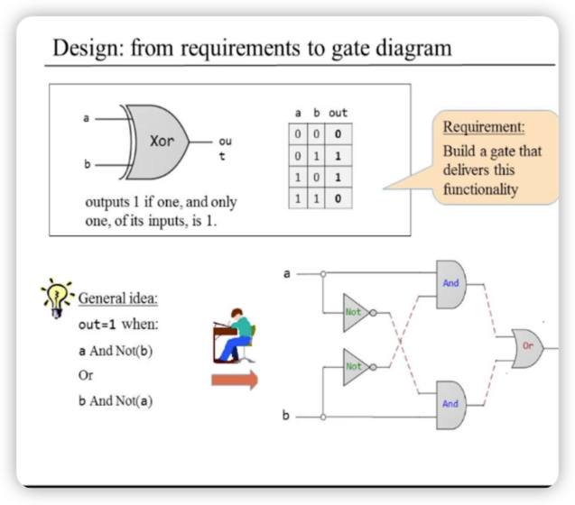
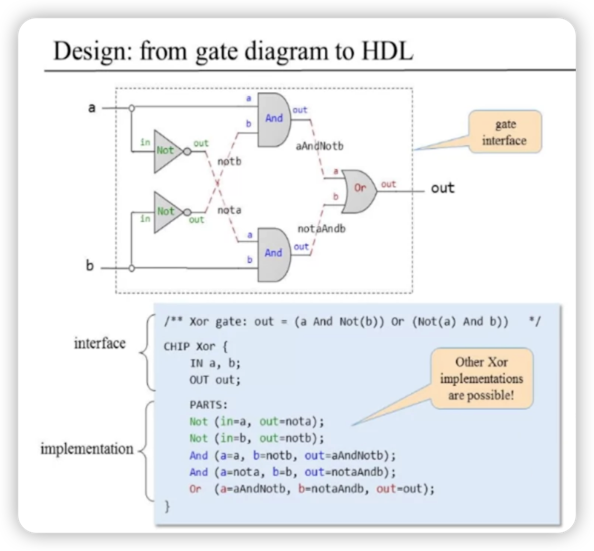
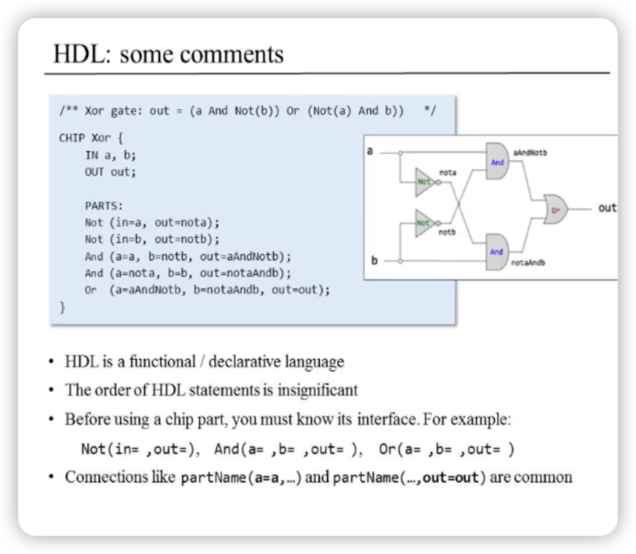

### Hareware Simulation 